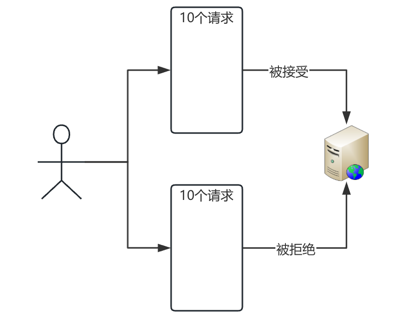
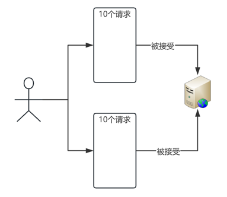
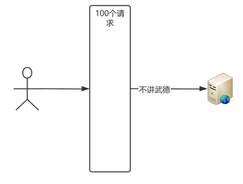
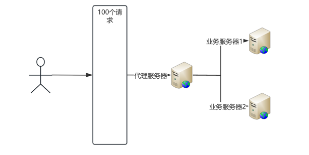

# scale-stateless

Knowledge sharing scale &amp; stateless

### 1.从一个简答的服务入手

1. 创建一个简单的服务，返回一个字符串
2. 返回统计请求的次数

### 2.进行单个服务的压测

1. 响应时间
2. 用户的并发数
3. 最大请求连接数

### 3.SCALE - 扩展性（Scalability）

#### 1. 垂直扩展（Vertical Scaling)  

定义：通过增加单个实例的资源（如 CPU、内存、存储等）来扩展系统的能力。 
在微服务架构中，垂直扩展通常意味着为某个服务实例分配更多的资源。  

#### 优点：

* 不需要增加额外的实例，管理相对简单。
* 适合资源瓶颈明显且资源利用率较低的场景。
  

#### 缺点：

* 单个实例的资源有限，扩展能力有上限。
* 需要停机进行资源升级，可能会导致服务中断。
  

#### 2. 水平扩展（Horizontal Scaling） 

定义：通过增加更多的实例（如服务器、容器或虚拟机）来扩展系统的能力。

#### 优点：

* 提高系统性能：通过增加资源或实例，可以更好地处理高并发请求。
* 增强系统可靠性：通过水平扩展，可以避免单点故障，提高系统的可用性。
* 优化成本：根据实际负载动态调整资源，避免资源浪费。
* 提升用户体验：通过快速响应请求，提供更好的用户体验。

### 3.水平拓展的问题

服务器统计数据不对了

### 4.如何解决

引入数据存储服务【redis】

### 3.微服务架构下直接使用Stateless和水平SCALE的好处

* 微服务架构的以下特性依赖于水平扩展：
* 独立部署与扩展：每个服务可以根据其负载需求独立扩展。
* 弹性伸缩：根据实时负载动态调整实例数量。
* 高可用性：通过增加多个实例避免单点故障。
* 负载均衡：通过负载均衡器将请求均匀分配到多个实例。
* 容器化和编排：容器化和编排工具提供自动化的水平扩展功能。