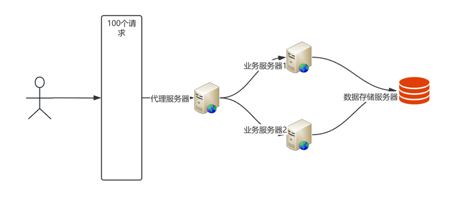

# scale & stateless

Knowledge sharing scale &amp; stateless

### 1.从一个简单的服务入手

1. 创建一个简单的服务，输入一个字符串，返回这个字符串的大写
2. 返回统计请求的次数

### 2.进行单个服务的压测

1. 响应时间
2. 用户的并发数
3. 最大请求连接数


### 3.SCALE - 可伸缩（Scalability）

可以根据实际情况动态的调整服务所提供的能力，当服务资源不足时，添加更多的资源来提升性能的能力。

#### 3.1 垂直扩展（Vertical Scaling) <br>

定义：通过增加单个实例的资源（如 CPU、内存、存储等）来扩展系统的能力。<br>
在微服务架构中，垂直扩展通常意味着为某个服务实例分配更多的资源。 <br>

#### 优点：

* 不需要增加额外的实例，管理相对简单。
* 适合资源瓶颈明显且资源利用率较低的场景。
  

#### 缺点：

* 单个实例的资源有限，扩展能力有上限。
* 需要停机进行资源升级，可能会导致服务中断。
  

#### 3.2 水平扩展（Horizontal Scaling）<br>

定义：通过增加更多的实例（如服务器、容器或虚拟机）来扩展系统的能力。


#### 优点：

* 提升用户体验：用户不会感知到服务的扩缩容，提供更好的用户体验。
* 提高系统性能：通过增加资源或实例，可以更好地处理高并发请求。
* 增强系统可靠性：通过水平扩展，可以避免单点故障，提高系统的可用性。
* 优化成本：根据实际负载动态调整资源，避免资源浪费。

### 4.水平拓展的问题

服务器统计数据不对了。
分析请求结果不一致的原因，是因为这里的服务是有状态的服务 <b>（需要数据共享）</b>。

### 5.如何数据共享

将服务拆分成为计算服务和存储服务。<br>
引入数据存储服务【redis】，将原有的服务变成无状态服务【Stateless】,引入存储服务【Stateful】。


### 6. 解决方案和案例

<b> 微服务设计：计算服务和存储服务分离 </b>

##### 状态外置化方案案例【将状态数据剥离到数据存储服务】

* 会话状态迁移：Spring Session + Redis
* 文件存储：对象存储替代本地文件系统
* 事务管理：分布式日志管理系统
* 配置中心：Consul/ZooKeeper替代本地配置文件

### 7. 工作中的体现

* <b>一个服务可以划分成无状态服务（计算型）和有状态服务（存储型）</b> <br>
* <b>7.1 对于无状态(计算类型)服务: </b><br>

项目中在k8s的配置中定义了HPA（Horizontal Pod Autoscaler）

```yaml
apiVersion: autoscaling/v2
kind: HorizontalPodAutoscaler
metadata:
  name: my-app-hpa
spec:
  scaleTargetRef:
    apiVersion: apps/v1
    kind: Deployment
    name: my-app
  minReplicas: 2 # 最小副本数量
  maxReplicas: 10 # 最大副本数量
  metrics:
    - type: Resource
      resource:
        name: cpu
        target:
          type: Utilization
          averageUtilization: 50 # 当 CPU 平均的使用率达到 50% 时开始自动扩缩容
```

* <b>7.2 针对于数据存储服务：</b><br>

项目中都是采用cluster集群的模式搭建，例如PostgreSQL，Redis，MongoDB。 <br>
延伸出来针对于集群内部这些需要数据同步就遵守<b>CAP</b>理论的。

* <b>7.3 水平扩展在微服务架构中的应用：</b>

  * 独立部署与扩展：每个服务可以根据其负载需求独立扩展。
  * 弹性伸缩：根据实时负载动态调整实例数量。
  * 高可用性：通过增加多个实例避免单点故障。
  * 负载均衡：通过负载均衡器将请求均匀分配到多个实例。
  * 容器化和编排：容器化和编排工具提供自动化的水平扩展功能。

### 8.云平台中对于Scale和Stateless的应用

* AWS：

> Lambda是AWS的核心无服务器计算服务，适合事件驱动和微服务架构。 <br>
> Amazon ECS(Elastic Container Service)

* Google Cloud：

> Google Cloud Functions和Google Cloud Run是的无服务器和容器化服务，支持自动扩展。

* Azure：

> Azure Functions和Azure Virtual Machine Scale Sets是Azure的无服务器和虚拟机扩展服务。

### 9.弹性伸缩的展开，实际场景中是非常复杂的

目前因为云平台的能力非常完善了，遇到资源问题可以很容易的进行弹性扩缩容。
如果设计一个弹性系统可能需要哪些角度考虑：


从上到下，依次是负载均衡服务器，业务服务器，数据服务器 <br>
负载均衡服务器：负载均衡服务器是整个系统的入口，它负责接收客户端的请求，并将请求分发到业务服务器。 <br>
业务服务器：业务服务器是整个系统的核心，它负责处理客户端的请求，并返回响应。 <br>
数据服务器：数据服务器是整个系统的存储，它负责存储业务服务器的数据。 <br>

#### 9.1 负载均衡服务器： <br>

* 硬件负载均衡器：使用专门的负载均衡硬件设备，如 F5 BIG-IP，通过轮询、加权轮询、最少连接等算法将请求分配到不同的服务器。
* 软件负载均衡：使用开源软件如 Nginx、HAProxy 等，通过配置不同的负载均衡策略来分配请求。
* 智能负载均衡算法：根据节点的实时负载情况（如 CPU 使用率、内存使用率、响应时间等）动态调整请求分配策略。

#### 9.2 业务服务器： <br>

* 分布式事务：使用分布式事务管理器如 TCC、2PC 等，或者一些对性能要求较高的场景可以通过本地消息队列和补偿机制来实现分布式事务
* 缓存一致性问题：一般采用延迟双删的策略。

#### 9.3 数据服务器： <br>

* 读写分离：使用主从复制或分片等策略，将读请求分发到多个服务器，将写请求写入主服务器，然后同步到从服务器。
* 数据强一致性：采用如 Paxos、Raft 等一致性协议，确保数据在多个节点间同步更新。这些协议通过选举主节点、投票等方式保证数据的一致性。
* 数据分片与复制：将数据分片存储在不同节点上，并在多个节点上保留数据的副本。通过定期同步副本数据来保证一致性。

#### 9.4 扩展平台本身的问题： <br>

* 资源管理与调度问题：例如Kuberneetes,YARN等资源管理框架。
* 配置管理与监控问题: 配置管理中心（AWS Securite Manager），监控中心（Prometheus，Grafana）。服务注册发现中心（Zookeeper服务编排）。
* 容错与高可用性问题: 数据库副本冗余，故障检测于自动恢复（心跳检测）。