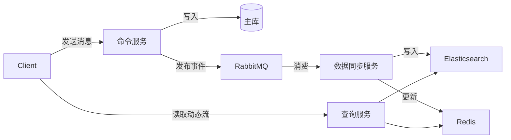

# scale-stateless

Knowledge sharing scale &amp; stateless

### 1.从一个简答的服务入手

1. 创建一个简单的服务，返回一个字符串
2. 返回统计请求的次数

### 2.进行单个服务的压测

1. 响应时间
2. 用户的并发数
3. 最大请求连接数


### 3.SCALE - 可伸缩（Scalability）

可以根据实际情况动态的调整服务所提供的能力，当服务资源不足时，添加更多的资源来提升性能的能力。

#### 3.1 垂直扩展（Vertical Scaling) <br>

定义：通过增加单个实例的资源（如 CPU、内存、存储等）来扩展系统的能力。<br>
在微服务架构中，垂直扩展通常意味着为某个服务实例分配更多的资源。 <br>

#### 优点：

* 不需要增加额外的实例，管理相对简单。
* 适合资源瓶颈明显且资源利用率较低的场景。
  

#### 缺点：

* 单个实例的资源有限，扩展能力有上限。
* 需要停机进行资源升级，可能会导致服务中断。
  

#### 3.2 水平扩展（Horizontal Scaling）<br>

定义：通过增加更多的实例（如服务器、容器或虚拟机）来扩展系统的能力。


#### 优点：

* 提高系统性能：通过增加资源或实例，可以更好地处理高并发请求。
* 增强系统可靠性：通过水平扩展，可以避免单点故障，提高系统的可用性。
* 优化成本：根据实际负载动态调整资源，避免资源浪费。
* 提升用户体验：通过快速响应请求，提供更好的用户体验。

### 3.水平拓展的问题

[幂等性]
服务器统计数据不对了。
分析请求不幂等的原因，是因为这里的服务是有状态的服务 <b>（需要数据共享）</b>。

### 4.如何数据共享

将服务拆分成为计算服务和存储服务。<br>
引入数据存储服务【redis】，将原有的服务变成无状态服务【Stateless】,引入计算服务【Stateful】。


### 5. 解决方案和案例

<b> 微服务设计：计算服务和存储服务分离 </b>

##### 状态外置化方案案例【将状态数据剥离到数据存储服务】

* 会话状态迁移：Spring Session + Redis
* 文件存储：对象存储替代本地文件系统
* 事务管理：分布式日志管理系统
* 配置中心：Consul/ZooKeeper替代本地配置文件

### 6. 总结

* <b>微服务划分可以分成无状态服务（计算型）和有状态服务（存储型）</b> <br>
* <b>6.1 对于无状态(计算类型)服务: </b><br>

项目中在k8s的配置中定义了HPA（Horizontal Pod Autoscaler）

```yaml
apiVersion: autoscaling/v2
kind: HorizontalPodAutoscaler
metadata:
  name: my-app-hpa
spec:
  scaleTargetRef:
    apiVersion: apps/v1
    kind: Deployment
    name: my-app
  minReplicas: 2 # 最小副本数量
  maxReplicas: 10 # 最大副本数量
  metrics:
    - type: Resource
      resource:
        name: cpu
        target:
          type: Utilization
          averageUtilization: 50 # 当 CPU 平均的使用率达到 50% 时开始自动扩缩容
```

* <b>6.2 针对于数据存储服务：</b><br>

项目中都是采用cluster集群的模式搭建，例如PostgreSQL，Redis，MongoDB。 <br>
延伸出来针对于集群内部这些需要数据同步就遵守<b>CAP</b>理论的。

* <b>6.3 微服务架构的以下特性依赖于水平扩展：</b>

独立部署与扩展：每个服务可以根据其负载需求独立扩展。
弹性伸缩：根据实时负载动态调整实例数量。
高可用性：通过增加多个实例避免单点故障。
负载均衡：通过负载均衡器将请求均匀分配到多个实例。
容器化和编排：容器化和编排工具提供自动化的水平扩展功能。

### 7.云平台中对于Scale和Stateless的应用

* AWS：

> Lambda是AWS的核心无服务器计算服务，适合事件驱动和微服务架构。 <br>
> Amazon ECS(Elastic Container Service)

* Google Cloud：

> Google Cloud Functions和Google Cloud Run是的无服务器和容器化服务，支持自动扩展。

* Azure：

> Azure Functions和Azure Virtual Machine Scale Sets是Azure的无服务器和虚拟机扩展服务。

### 8.弹性伸缩的展开

目前因为云平台的能力非常完善了，遇到资源问题可以很容易的进行弹性扩缩容。
如果设计一个弹性系统可能需要哪些角度考虑：



从上到下，依次是负载均衡服务器，业务服务器，数据服务器 <br>
负载均衡服务器：负载均衡服务器是整个系统的入口，它负责接收客户端的请求，并将请求分发到业务服务器。 <br>
业务服务器：业务服务器是整个系统的核心，它负责处理客户端的请求，并返回响应。 <br>
数据服务器：数据服务器是整个系统的存储，它负责存储业务服务器的数据。 <br>

负载均衡服务器： <br>

* 硬件负载均衡器：使用专门的负载均衡硬件设备，如 F5 BIG-IP，通过轮询、加权轮询、最少连接等算法将请求分配到不同的服务器。
* 软件负载均衡：使用开源软件如 Nginx、HAProxy 等，通过配置不同的负载均衡策略来分配请求。
* 智能负载均衡算法：根据节点的实时负载情况（如 CPU 使用率、内存使用率、响应时间等）动态调整请求分配策略。

业务服务器： <br>

* 分布式事务：使用分布式事务管理器如 TCC、SAGA 等，实现跨服务的事务处理。
* 缓存一致性机制：在分布式缓存系统中，使用缓存一致性协议（如 MESI 协议）来管理缓存数据的一致性。
* 数据分片与复制：将数据分片存储在不同节点上，并在多个节点上保留数据的副本。通过定期同步副本数据来保证一致性。
